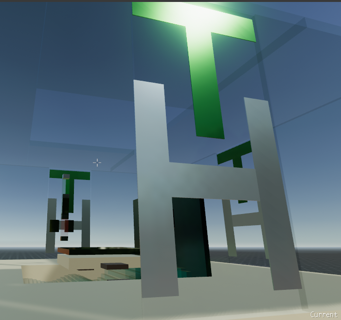

Decentralized hotel prototype for Decentraland. Fully programmatic.  No 3d models needed.

Why a decentralized hotel? Well, there is decentralized land and there are decentralized houses, so why not a hotel?

The hotel will create a new floor for your suite by simply *clicking either the golden elevator platform or the golden rectangular rod in the lobby*. 

Beware the elevator is in "open house" mode and simply travels up and down. It's having issues and should be repaired shortly, so you may find some jumping on and off of it useful.

The maximum amount of floors you can create seems to be about 4 but I have designed this first version to be "airy" so the floors could be stacked closer together.

The lobby features clickable doors that rotate nicely in the center for a more wide open effect, and there are 3 meters of free walking space around the lobby level.

Simply by standing on the elevator platform, a new floor of the hotel will be created as the elevator platform arrives at the top (optional permanent sky bar or penthouse).

Rooms are actually wider than the lobby, a full 14 meters out of the allowed 16 meters, overhanging the lobby level to allow for pedestrian traffic and virtual car parking.

Perhaps a person who doesn't own virtual real estate can maintain a room for a time based on an escrow shared between the hotel and the guest, thus allowing the guest to leave and come back to their own room, with their own untouched encrypted belongings such as many online games allow players a virtual room or allow them to buy virtual land.

Modules such as conference rooms and other useful modules/floors so may be a good place to rent out for those interested in meeting in Decentraland.
