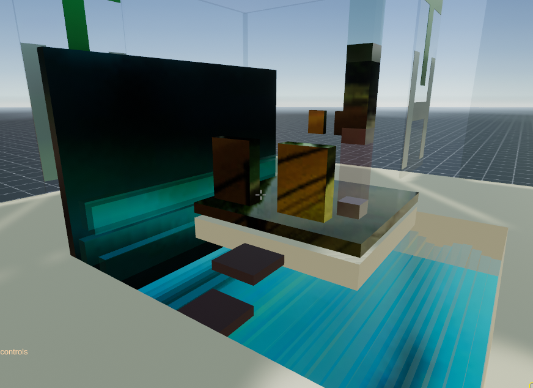

Fully programmatic Decentralized hotel prototype for Decentraland. Create an entire new floor for yourself by pressing a button.

Visit at  https://export.c15.now.sh 

*Instructions:*

Create a new hotel guest floor for yourself by clicking the blue button next to the elevator.  The golden button will call the elevator down if it is on an upper floor.

Stand on the elevator and use the up (green) or down (red) buttons to move. Use the center gold button to stop the elevator.

*Requires:* decentraland-ecs-utils (not included here)

*Description:*

Why a decentralized hotel? Well, there is decentralized land and there are decentralized houses, so why not a hotel?

The lobby features clickable doors that rotate nicely in the center for a more wide open effect, and there are 3 meters of free walking space around the lobby level.

Simply by standing on the elevator platform, a new floor of the hotel will be created as the elevator platform arrives at the top (optional permanent sky bar or penthouse).

Rooms are actually wider than the lobby, a full 14 meters out of the allowed 16 meters, overhanging the lobby level to allow for pedestrian traffic and virtual car parking.

Perhaps a person who doesn't own virtual real estate can maintain a room for a time based on an escrow shared between the hotel and the guest, thus allowing the guest to leave and come back to their own room, with their own untouched encrypted belongings such as many online games allow players a virtual room or allow them to buy virtual land.

Modules such as conference rooms and other useful modules/floors so may be a good place to rent out for those interested in meeting in Decentraland.
